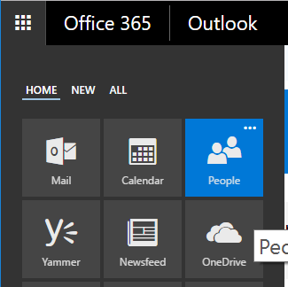

# Implementing a survey with Outlook actionable messages and Office 365 Group connectors

In this exercise, we'll go step-by-step to implement a survey using Outlook actionable messages. The survey app will allow a user to send a multiple-choice question to users, who can respond right from within Outlook using actions on the message. The app will tally results and send them to an Office 365 group once the survey has closed.

> **Note:** If you run into unexpected errors while following these steps, see [Troubleshooting](troubleshooting.md).

You can access the code of the completed exercise by downloading the `completed-exercise` branch of this repository.

## Prerequisites

In order to complete this exercise, you'll need the following:

- Visual Studio 2015 or later.
- [Postman](https://www.getpostman.com/) (or a similar tool to send HTTP POST requests)
- [ngrok](https://ngrok.com/)
- An Office 365 account

## Configure the web app

In this section, we'll download the starter solution and configure it to send messages via the [Microsoft Graph](https://developer.microsoft.com/en-us/graph).

Download or clone the repository, then open **SimpleSurvey.sln** in Visual Studio. The solution is comprised of 3 projects:

| Project | Description |
|---|---|
| [MessageCard.csproj](MessageCard/MessageCard.csproj) | This is a simple class library to represent the [actionable message JSON format](https://docs.microsoft.com/en-us/outlook/actionable-messages/card-reference). |
| [SimpleSurvey.csproj](SimpleSurvey/SimpleSurvey.csproj) | This is an MVC web app that sends messages via Microsoft Graph with actionable message cards. |
| [SurveyModels.csproj](SurveyModels/SurveyModels.csproj) | This is a simple class library with model classes that will be shared between the web app and the web API to be added later. |
| [SurveyService.csproj](SurveyService/SurveyService.csproj) | This is a web API project that creates and stores surveys in a local database. |

> **Note:** The **SurveyService** project uses SQL Server 2016 Express Local DB. If you do not have this already installed, you can download it from the [SQL Server Downloads](https://www.microsoft.com/en-us/sql-server/sql-server-downloads). Choose the **Download Now** button beneath **Express edition**. Run the installer and choose the **Download Media** option. Select the **LocalDB** package when prompted. Double-click the downloaded file to install.
>
> Alternatively, if you have access to another SQL instance (either locally or remote), feel free to update the `SurveyContext` connection string in `./SurveyService/Web.config`.

Before you try this out, you need to configure an application ID and password. The app uses Azure's [OAuth 2.0 Authorization Code Flow](https://docs.microsoft.com/en-us/azure/active-directory/develop/active-directory-v2-protocols-oauth-code) to get access tokens for the Microsoft Graph, which requires that you register the app to get an app ID and password.

### Register the app with Azure

1. Open a browser and browse to [https://apps.dev.microsoft.com/](https://apps.dev.microsoft.com/).
1. Sign in with an Office 365 account or an Outlook.com account, then select the **Add an app** button.
1. Enter a name for the registration and select **Create application**.
1. Locate the **Application Secrets** section and choose the **Generate New Password** button. Copy the password that is generated in the popup and save it somewhere.
1. Locate the **Platforms** section and choose **Add Platform**.
1. Choose **Web**, then enter `http://localhost:1956/` under **Redirect URIs**.
1. Choose **Save** to finalize the registration. Copy the value of **Application Id** and save it somewhere.

### Add the values to the code

1. In Visual Studio, expand the **SimpleSurvey** project and open the **Web.config** file.
1. Find the following lines:

    ```xml
    <add key="ida:AppId" value="" />
    <add key="ida:AppSecret" value="" />
    ```
1. Set the value of the `ida:AppId` key to the application ID you generated in the app portal.
1. Set the value of the `ida:AppSecret` key to the application password you generated in the app portal.

### Test the app

Right-click the **Solution 'SimpleSurvey'** node in **Solution Explorer** and choose **Properties**. Expand **Common Properties** and choose **Startup Project**. Select **Multiple startup projects**, then change the **Action** value for **SimpleSurvey** and **SurveyService** to "Start". Click **OK**. This will allow us to set breakpoints in both projects and make it much easier to debug.

Save your changes and press **F5** to build and run the app. A browser should open to the home page which asks you to sign in to create a survey. Sign in with an Office 365 account and grant access to the app. Once you're signed in, you should see a form that allows you to create and send a survey. Fill in the form and add a few choices, then choose **Send this poll**.


Log in to Outlook on the web with the same account. You should have a new message with a rendered message card.


The **Submit** action doesn't work yet. By the end of this exercise we'll change that.

#### What just happened?

If everything worked, the **SimpleSurvey** web app sent a request to the **SurveyService** web API to create a survey in its database. The web API returned data to the web app which includes the survey ID and limited purpose tokens for each participant. The web app then includes that information in the action it sends in the actionable message. If you'd like to see this in more detail, set breakpoints on `public async Task<ActionResult> SendSurvey(Survey Survey, string ToRecipients)` in **./SimpleSurvey/Controllers/SurveyController.cs**, and `public IHttpActionResult PostSurvey(CreateSurveyRequest surveyRequest)` in **./SurveyService/Controllers/SurveysController.cs**. Repeat the test above and step through the code.

### Modify the card for testing

Now let's make a few minor changes to the message format to make it easier to see our changes.

1. In **SurveyController.cs**, locate the following line:

    ```C#
    card.HideOriginalBody = true;
    ```

    Change this value to `false`:

    ```C#
    card.HideOriginalBody = false;
    ```
1. In `LoadSurveyMessageBody`, replace the `Your email client cannot display this survey.` message with the JSON card payload. The updated method should look like this:

    ```C#
    private string LoadSurveyMessageBody(Card surveyCard)
    {
        return
            "<html>" +
            "  <head>" +
            "    <meta http-equiv=\"Content-Type\" content=\"text/html; charset=utf-8\">" +
            "    <script type=\"application/ld+json\">" +
            surveyCard.ToJson() +
            "    </script>" +
            "  <head>" +
            "  <body>" +
            surveyCard.ToJson() +
            "  </body>" +
            "</html>";
    }
    ```

With those changes, we're adding the JSON representation of the card into the message body and not hiding it. That way we can see all the details while we're testing.

### Test the modified card

Press **F5** to build and run the project.

Sign in and send a survey to yourself. You should see the JSON card in the body of the message with the limited purpose token and the survey ID. However, if you try to respond to the survey, you should get a **The action could not be completed** error. That's because our action is still targeting `https://...`. In the next section we'll tackle implementing a target for our action.

---

## Implementing the action target

In this section we'll extend the Web API to include a new API that will serve as the target for the submit action in the actionable message.

### Implementing the RespondToSurvey action

Before we add a method to our Web API to handle the survey response, we need to address how the actionable message actions actually work. We're running the web app and web API locally using IIS Express and Visual Studio, which won't work for an actionable message! The target of any action on an actionable message has to be a public HTTPS endpoint. While we can do HTTPS via Visual Studio, the endpoint is `http://localhost`, which the Office 365 servers can't reach.

We could solve this by publishing our project to a public server like an Azure website. However, another option that makes for easy testing on our local devlopment machines is [ngrok](https://ngrok.com/). We'll use that for this guide.

#### Setup ngrok

Head over to the [ngrok website](https://ngrok.com/) and download the tool. I recommend saving it somewhere in your PATH so it's easier to use from the command line.

1. In Visual Studio, select the **SurveyService** project in **Solution Explorer**. In the **Properties** window, locate the **URL** value and copy the port number from the URL.

    
1. Open a command prompt and run ngrok using the following command. Replace the `<port-number>` placeholder with the port number you copied in the previous step.

    ```Shell
    ngrok http <port-number> -host-header=localhost:<port-number>
    ```
1. In the ngrok output, locate the forwarding HTTPS URL and copy it. This will be our target URL for actions.

    

Leave the command prompt with ngrok running open. As long as ngrok is running, any requests made to the forwarding URLs will be tunneled to localhost.

> **Note:** If you stop ngrok (with CTRL+C), you can always run it again. However, the URL will change, so keep in mind that you will need to update your code each time.

#### Create a model for survey responses

1. Right-click the **SurveyModels** project and choose **Add**, then **Class**. Name the class `RespondToSurveyRequest`.
1. Open **RespondToSurveyRequest.cs** and update the class with the following code.

    ```C#
    public class RespondToSurveyRequest
    {
        public string UserId { get; set; }
        public int SurveyId { get; set; }
        public string LimitedToken { get; set; }
        public string Response { get; set; }
    }
    ```

Notice that this matches the JSON structure of the `body` value in the action in our card.

#### Add a controller for responses

1. Right-click the **Controllers** folder under the **SurveyService** project and choose **Add**, then **Controller**. Choose **Web API 2 Controller - Empty** and click **Add**. Name the controller **ResponsesController** and click **Add**.
1. Open the **ResponsesController.cs** file and add the following `using` directives at the top of the file.

    ```C#
    using SurveyModels;
    using SurveyService.Models;
    using SurveyService.Tokens;
    ```
1. Add the following method to the `ResponsesController` class.

    ```C#
    public IHttpActionResult PostResponse(RespondToSurveyRequest surveyResponse)
    {
        return Ok(surveyResponse);
    }
    ```

That doesn't do much yet, but it's enough for us to verify that the ngrok proxy is working. Let's update the web app to set a valid target URL on the actions so we can test.

#### Update the web app

1. Open the **SurveyController.cs** file in the **SimpleSurvey** project and add the following member to the `SurveyController` class:

    ```C#
    // TODO: Update this value with the new ngrok forwarding URL 
    // each time you restart ngrok
    private string actionBaseUrl = "https://d8765f20.ngrok.io";
    ```

1. If ngrok is not running, go ahead and start it and copy the HTTPS fowarding URL. Replace the value with your current URL.
1. Find the line that reads:

    ```C#
    Target = "https://...",
    ```

    And update it like so:

    ```C#
    Target = actionBaseUrl + "/api/responses",
    ```

#### Test the response API

1. Save all the changes you've made to the project files so far.
1. Set a breakpoint on the `PostResponse` method on the `ResponsesController` class.
1. Press **F5** to build and run the project.
1. Browse to the Simple Survey web app, sign in, and send a survey to yourself.
1. Using Outlook on the web, check the received message. In the body of the message, you should see something similar to:

    ```json
    "target":"https:\/\/d8765f20.ngrok.io\/api\/responses"
    ```
1. Choose an option on the survey and click the **Submit** button.

If everything is working correctly, Visual Studio should break on your breakpoint. If you press **F5** to continue, you should see a message that the action completed successfully in Outlook on the web.

> **Note:** With **SurveyService** set as the startup project, you can set breakpoints in that project. However, your browser will no longer automatically open to the **SimpleSurvey** web app. You can swith the startup projects back and forth, or you can simply manually browse to the web app at http://localhost:1956/.

#### Recording the response

Now let's modify the `PostResponse` method to actually record the response. Replace the existing `PostResponse` with the following.

```C#
public IHttpActionResult PostResponse(RespondToSurveyRequest surveyResponse)
{
    try
    {
        using (var db = new SurveyContext())
        {
            // Make sure the survey ID is valid
            SimpleSurvey survey = db.Surveys.Find(surveyResponse.SurveyId);
            if (survey == null)
            {
                return BadRequest("Invalid survey ID");
            }

            // Is the response a valid one?
            string[] validResponses = survey.QuestionChoices.Split(';');
            int userResponseIndex = Convert.ToInt32(surveyResponse.Response) - 1;
            if (userResponseIndex < 0 || userResponseIndex >= validResponses.Length)
            {
                return BadRequest("Invalid response");
            }

            // Is the user a participant?
            Participant responder = survey.Participants.FirstOrDefault(p => p.Email == surveyResponse.UserId.ToLower());
            if (responder == null)
            {
                return BadRequest("Invalid participant");
            }

            // Is the limited purpose token a match?
            string expectedToken = TokenGenerator.GenerateLimitedToken(survey.SimpleSurveyId, responder.Email, responder.TokenSalt);
            if (surveyResponse.LimitedToken != expectedToken)
            {
                return BadRequest("Limited purpose token validation failed");
            }

            // Has the user already responded?
            Response previousResponse = survey.Responses.FirstOrDefault(r => r.Participant == responder);
            if (previousResponse != null)
            {
                return BadRequest("Participant has already responded");
            }

            // Has the survey expired?
            if (DateTime.Compare(survey.Expiration, DateTime.UtcNow) < 0)
            {
                return BadRequest("Survey expired");
            }

            // Create the response object
            Response response = new Response
            {
                Participant = responder,
                ParticipantResponse = validResponses[userResponseIndex],
                Survey = survey
            };

            db.Responses.Add(response);
            db.SaveChanges();

            return Ok();
        }
    }
    catch (Exception ex)
    {
        return BadRequest(ex.Message);
    }
}
```

This version of the method checks a number of conditions before writing to the database.

- Is the survey ID valid?
- Is the user a participant for the survey?
- Does the limited purpose token validate?
- Has the user already responded?
- Has the survey expired?

If everything checks out, only then does it write to the database. Go ahead and try this out now. You should be able to respond to a survey using the actionable message. Now try responding a second time, you should get a **The action could not be completed** this time.

> **Note:** Because this demo solution is not registered with Microsoft, you cannot send actionable messages to anyone outside of your organization. Also, while you can send the message to others in your organization, and they will see the message card, they cannot invoke the actions.

This covers the basic functionality, but it isn't quite a complete solution.

- The `PostResponse` method is open. If an attacker obtained a limited purpose token for a user, they could post a response.
- When the post fails, the user is given no meaningful error message, just **The action could not be completed**.
- When the post succeeds, the user gets a generic success message rather than a useful response.

Let's fix these issues!

#### Preventing posts from outside sources

Our `PostResponse` API should only ever except POST requests from the Office 365 service. To help our service determine that the POST is legitimate, Office 365 adds a bearer token to each request in the `Authorization` header. So all we need to do is validate it. Microsoft has made it easy for us to do that by providing a NuGet package that will do all the validation for us.

1. On the **Tools** menu, choose **NuGet Package Manager**, then **Manage NuGet Packages for Solution...**. Click the **Browse** tab, then enable the **Include prerelease** option. Search for `Microsoft.O365.ActionableMessages.Utilities`. Select **Microsoft.O365.ActionableMessages.Utilities** in the list of packages, then put a check in the box next to the **SurveyService** project. Click **Install**.
1. Open the **ResponsesController.cs** file and add the following `using` directive at the top of the file.

    ```C#
    using Microsoft.O365.ActionableMessages.Authentication;
    using System.Net.Http.Headers;
    using System.Threading.Tasks;
    ```
1. Add the following member to the `ResponsesController` class (replace the value with your current ngrok forwarding URL):

    ```C#
    // TODO: Update this value with the new ngrok forwarding URL 
    // each time you restart ngrok
    private string actionBaseUrl = "https://215fe7e9.ngrok.io";
    ```
1. Add a new function to the `ResponsesController` class.

    ```C#
    private async Task<bool> ValidateAuthorizationHeader(AuthenticationHeaderValue authHeader, string targetUrl, string userId)
    {
        // Validate that we have a bearer token
        if (authHeader == null ||
            !string.Equals(authHeader.Scheme, "bearer", StringComparison.OrdinalIgnoreCase) ||
            string.IsNullOrEmpty(authHeader.Parameter))
        {
            return false;
        }

        // Validate the token
        ActionableMessageTokenValidator validator = new ActionableMessageTokenValidator();
        ActionableMessageTokenValidationResult result = await validator.ValidateTokenAsync(authHeader.Parameter, targetUrl);
        if (!result.ValidationSucceeded)
        {
            return false;
        }

        // Token is valid, now check the sender and action performer
        // Both should equal the user
        if (!string.Equals(result.ActionPerformer, userId, StringComparison.OrdinalIgnoreCase) ||
            !string.Equals(result.Sender, userId, StringComparison.OrdinalIgnoreCase))
        {
            return false;
        }

        return true;
    }
    ```
1. Update the `PostResponse` function to be asynchronous. Change the function declaration:

    ```C#
    public IHttpActionResult PostResponse(RespondToSurveyRequest surveyResponse)
    ```

    to the following:

    ```C#
    public async Task<IHttpActionResult> PostResponse(RespondToSurveyRequest surveyResponse)
    ```

1. Update the function to call the `ValidateAuthorizationHeader` function. Insert the following code before the `try` statement:

    ```C#
    // Validate the authorization header
    bool isTokenValid = await ValidateAuthorizationHeader(Request.Headers.Authorization,
        actionBaseUrl, surveyResponse.UserId);
    if (!isTokenValid)
    {
        return Unauthorized();
    }
    ```

You should now be able to run and test this new code. When posting a response from Outlook on the web, you should see no change. To validate that it actually blocks POST requests that don't have a valid bearer token, try using Postman to POST to `<your ngrok URL>/api/responses` with a simple response payload:

```json
{
    "UserId": "adelev@contoso.com", 
    "SurveyId": "5",
    "LimitedToken": "yxMhqvjGMoKu2yHxD4fEjBx45MNbXA\/Gd+xvOywT8Kg=",
    "Response": "Hello" 
}
```

You should get a `401 Unauthorized` response. Now let's move on to improving error messages.

#### Return a custom error response

For some of our error cases, we're not concerned about providing a friendly message. For example, if the bearer token is invalid, we shouldn't be concerned about giving an unauthorized user a helpful response! However, in some cases a legitimate user may do something wrong, and we should definitely be helpful in those cases. For example, when we tried responding to a survey more than once, we only got a generic message. Let's update the service to explain to the user what exactly went wrong.

In order to return a custom message, we need to include a [CARD-ACTION-STATUS](https://docs.microsoft.com/en-us/outlook/actionable-messages/card-reference#reporting-an-actions-execution-success-or-failure) header in the response.

1. Add the following function to the `ResponsesController` class to generate a 400 error with a `CARD-ACTION-STATUS` message.

    ```C#
    private IHttpActionResult GenerateFriendlyResponse(string message)
    {
        HttpResponseMessage friendlyResponse = new HttpResponseMessage(HttpStatusCode.BadRequest);
        friendlyResponse.Headers.Add("CARD-ACTION-STATUS", message);
        return ResponseMessage(friendlyResponse);
    }
    ```
1. Update the `PostResponse` function to call this method rather than `BadRequest` when the user has already responded.

    ```C#
    // Has the user already responded?
    Response previousResponse = survey.Responses.FirstOrDefault(r => r.Participant == responder);
    if (previousResponse != null)
    {
        return GenerateFriendlyResponse("You've already responded to this survey!");
    }
    ```
1. Update the `PostResponse` function to call this method rather than `BadRequest` when the survey has expired.

    ```C#
    // Has the survey expired?
    if (DateTime.Compare(survey.Expiration, DateTime.UtcNow) < 0)
    {
        return GenerateFriendlyResponse("This survey's response window has closed! Your response has not been recorded.");
    }
    ```

Leave the other validation checks as they are. Those would most likely only happen if someone is trying to spoof a real response, so we'll leave them alone.

Go ahead and test your service now. Try responding to a survey twice. The second time you should get a message **You've already responded to this survey!**.

Now let's look at improving the user experience when they successfully respond.

#### Return a refresh card

Now that we know how to return custom responses, we could use the same approach to send a message like "Thanks for responding!" to the user. However, that isn't a great solution since they still have the choice dropdown and the submit button on the card. There's nothing to stop the user from trying to respond again. It would be better if we could remove that UI altogether. With [refresh cards](https://docs.microsoft.com/en-us/outlook/actionable-messages/card-reference#refresh-cards), we can!

The idea with refresh cards is that our service can return a whole new JSON card payload, and the client will replace what's there with the new card. This allows us to change the UI to remove the actions they can no longer take, and to provide more information. For example, after the user responds, we could return a snapshot of the current responses. Let's update the service to do just that.

1. Add a function to the `SimpleSurvey` class to generate a statistics card containing the total number of responses currently in the database. Open the **SimpleSurvey.cs** file in the **Models** folder and add `using MessageCard;` to the top of the file. Then add the following code:

    ```C#
    public Card GenerateSurveyResultSnapshotCard()
    {
        Card statsCard = new Card();
        statsCard.ThemeColor = "00B200";
        statsCard.HideOriginalBody = true;
        statsCard.Title = $"Thanks for responding to \"{Name}\"";

        Section section = new Section();
        section.Title = $"The question was: \"{QuestionTitle}\"";
        section.Text = $"Responses as of {DateTime.Now.ToString("MM/dd/yy \"at\" HH:mm \"UTC\"")}";

        List<Fact> facts = new List<Fact>();

        string[] surveyChoices = QuestionChoices.Split(';');
        foreach (string choice in surveyChoices)
        {
            int numResponses = Responses.FindAll(r => string.Equals(r.ParticipantResponse, choice, StringComparison.OrdinalIgnoreCase)).Count;
            facts.Add(new Fact() { Name = choice, Value = numResponses.ToString() });
        }

        section.Facts = facts;

        statsCard.Sections = new List<Section>() { section };

        return statsCard;
    }
    ```

    This builds a card that utilizes the `facts` field of a [section](https://docs.microsoft.com/en-us/outlook/actionable-messages/card-reference#section-fields). Facts are used to render a list of key/value pairs, which is perfect for a list of responses and counts. It queries the database to get the current counts for each possible response.

1. Open the **ResponsesController.cs** file. Add a method to the `ResponsesController` to generate a `200` response with the card's JSON in the body and the `CARD-UPDATE-IN-BODY` header set to `true`.

    ```C#
    private IHttpActionResult GenerateRefreshCardResponse(Card refreshCard)
    {
        HttpResponseMessage refreshCardResponse = new HttpResponseMessage(HttpStatusCode.OK);
        refreshCardResponse.Headers.Add("CARD-UPDATE-IN-BODY", "true");

        // Serialize the card as JSON to the response body
        refreshCardResponse.Content = new StringContent(refreshCard.ToJson(), System.Text.Encoding.UTF8, "application/json");
        return ResponseMessage(refreshCardResponse);
    }
    ```

1. Update the `PostResponse` function to generate a refresh card and send it in the response. Replace the `return Ok();` line with the following.

    ```C#
    return GenerateRefreshCardResponse(survey.GenerateSurveyResultSnapshotCard());
    ```

Save all of your changes and test. Send a new survey using the web app and then use Outlook web app to respond. You should now see that the card is refreshed with a count of the current responses.


Now that we have the survey response feature working, let's look at reporting the results once the survey closes.

---

## Sending the results to an Office 365 Group

Now let's look at what happens when a survey closes. The whole point of doing a survey is to collect data, so there has to be some way for the sender to view the results. We could enhance the web app to allow the user to view their survey results, but that requires the sender to remember to go log in to the site and view the results at the right time. Instead, we'll track the closing time in our web API and send out a message card with the results. We could certainly send this directly to the sender, using the same methods we use in the web app to send the survey. But since we've already covered that, let's look at an alternative: [Connectors for Groups](https://docs.microsoft.com/en-us/outlook/actionable-messages/actionable-messages-via-connectors). We can use this to push a message card directly to a group, so all members of that group can see the results.

### Set up a group

First we need to choose a group to receive the results. You can either use an existing group or create a new one.

1. Login to Outlook on the web, and go to the **People** app.

    
1. Expand **Groups** in the left-hand menu, then either select an existing group or create a new one.
1. With the group selected, select **Connectors** in the top menu.

    
1. In the list of available connectors, select **Add** for the **Incoming Webhook** connector.
1. Enter a name for the connector and select **Create**.
1. Copy the URL that is generated and save it, we'll need it soon.

    

### Generate a final results card

Now let's add a function to the `SimpleSurvey` class to generate a final results card. This will be very similar to the snapshot card we used as a refresh card, but with slight differences.

1. Open the **SimpleSurvey.cs** file in the **Models** folder and add the following code:

    ```C#
    public Card GenerateSurveyResultFinalCard()
    {
        Card statsCard = new Card();
        statsCard.ThemeColor = "00B200";
        statsCard.HideOriginalBody = true;
        statsCard.Title = $"Final result for \"{Name}\"";
        statsCard.Text = $"{Responses.Count} of {Participants.Count} participants responded.";

        Section section = new Section();
        section.Title = $"The question was: \"{QuestionTitle}\"";
        section.Text = "Here's how particpants responded";

        List<Fact> facts = new List<Fact>();

        string[] surveyChoices = QuestionChoices.Split(';');
        foreach (string choice in surveyChoices)
        {
            int numResponses = Responses.FindAll(r => string.Equals(r.ParticipantResponse, choice, StringComparison.OrdinalIgnoreCase)).Count;
            facts.Add(new Fact() { Name = choice, Value = numResponses.ToString() });
        }

        section.Facts = facts;

        section.Actions = new List<MessageCard.Action>()
        {
            // Add a button to open a URL
            // For example, this could be a link into a web app that displays the
            // results in a rich manner 
            new OpenUri()
            {
                Name = "View Result Details",
                Targets = new List<OpenUriTarget>()
                {
                    new OpenUriTarget() { OS = "default", Uri = "https://..." }
                }
            }
        };

        statsCard.Sections = new List<Section>() { section };

        return statsCard;
    }
    ```

A big difference between the snapshot and the final card is that we add an OpenUri action. We're just adding a placeholder URL here, but the idea is that in a real survey application, you may have a web app view of the results that gives more details or a richer view of the results.

### Create an API for sending results

Now let's create a new API to query the database for all expired surveys and send their results.

1. Right-click the **Controllers** folder in the **SurveyService** project and choose **Add**, then **Controller**. Choose **Web API 2 Controller - Empty** and click **Add**. Name the controller **SendResultsController** and click **Add**.
1. Open the **SendResultsController.cs** file and add the following `using` directives at the top of the file.

    ```C#
    using SurveyService.Models;
    using MessageCard;
    using System.Threading.Tasks;
    ```
1. Add a private string member to the `SendResultsController` class for the webhook URL you generated earlier. Replace the value in the code below with the value you copied.

    ```C#
    private string webHookUrl = "https://outlook.office.com/webhook/...";
    ```
1. Add a method to the `SendResultsController` class to send results.

    ```C#
    public async Task<IHttpActionResult> PostSendResults()
    {
        try
        {
            using (var db = new SurveyContext())
            {
                var expiredSurveys = db.Surveys.Where(s => !s.ResultsReported && DateTime.Compare(s.Expiration, DateTime.UtcNow) < 0).ToList();

                if (expiredSurveys.Count > 0)
                {
                    using (var client = new HttpClient())
                    {
                        foreach (SimpleSurvey survey in expiredSurveys)
                        {
                            // Generate the card
                            Card resultsCard = survey.GenerateSurveyResultFinalCard();

                            // Post the card to the webhook
                            HttpResponseMessage response = await client.PostAsJsonAsync(webHookUrl, resultsCard);
                            response.EnsureSuccessStatusCode();

                            // Mark the survey as reported
                            survey.ResultsReported = true;
                            db.SaveChanges();
                        }
                    }
                }
            }

            return Ok();
        }
        catch (Exception ex)
        {
            return BadRequest(ex.Message);
        }
    }
    ```

### Testing sending results

Now that we have the API in place to send out the results, we could invoke it in a number of different ways. We could have a scheduled task or a Windows service that calls the API at set intervals. But for our purposes, we'll just invoke it manually using Postman.

1. Open Postman. Create a new tab if needed and configure the tab as follows:
    - Click the **GET** and change to **POST**.
    - In the text box labeled `Enter request URL` paste the base URL for your Web API add `api/sendresults`
1. Click **Send**.

Assuming everything worked, and that you have surveys that have expired in your database, you should get result messages posted into your Office 365 Group. 

---

## Wrapping Up

Let's sum up what the exercises in this lab have covered.

- We saw how to send actionable messages directly to users in email. In this solution we used the Microsoft Graph, but you could also use SMTP.
- We saw how to implement a Web API to act as the target for the actions in the actionable message. In this solution we used an ASP.NET Web API, but you could use any web server technology.
- We saw how to validate the bearer token on incoming action requests.
- We saw how to return custom error responses and refresh cards in response to actions.
- We saw how to post actionable messages directly to an Office 365 group.

We hope that gives you a taste of what you can accomplish with actionable messages and connectors. To learn more, visit [https://docs.microsoft.com/en-us/outlook/actionable-messages/](https://docs.microsoft.com/en-us/outlook/actionable-messages/).