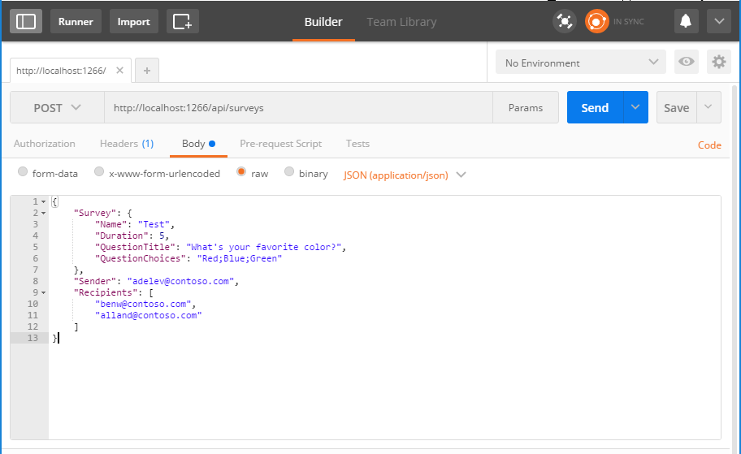

# Troubleshooting

The following are some errors or problems you might run into while going through this exercise.

## The specified port is in use

When debugging the project, IIS Express may refuse to start with the following error.


To fix this, use Task Manager to locate the process with the process ID reported and shut it down.

## SurveyService requires SQL Server 2016 Express LocalDB

Visual Studio may present an error indicating that SQL Server 2016 Express LocalDB is required.


To fix this, visit the [SQL Server Downloads page](https://www.microsoft.com/en-us/sql-server/sql-server-downloads). Choose the **Download Now** button beneath **Express edition**. Run the installer and choose the **Download Media** option. Select the **LocalDB** package when prompted. Double-click the downloaded file to install.

## Web API doesn't seem to be working

### Test creating a survey from Postman

Test the Web API from Postman and verify that it creates the survey and saves it in the database. We'll use [Postman](https://www.getpostman.com/) to send a request to our API, so if you don't have that installed, go ahead and download and install that before proceeding.

1. Press **F5** to build and run the project. A browser should open and display a `403.14 Forbidden` error. This is normal. Copy the URL from the browser, which should look like `http://localhost:1266/`. (**Note:** The port number for your project may be different.)
1. Open Postman. Create a new tab if needed and configure the tab as follows:
    - Click the **GET** and change to **POST**.
    - In the text box labeled `Enter request URL` paste the URL you copied from the brower and add `api/surveys`
    - Click **Body** underneath the URL, then select the **raw** option.
    - Click **Text** and change to **JSON (application/json)**.
    - Enter the following in the text area below:
    
        ```json
        {
          "Survey": {
            "Name": "Test",
            "Duration": 5,
            "QuestionTitle": "What's your favorite color?",
            "QuestionChoices": "Red;Blue;Green"
          },
          "Sender": "adelev@contoso.com",
          "Recipients": [
            "benw@contoso.com",
            "alland@contoso.com"
          ]
        }
        ```

      The Postman window should look like this when you are done:

      
4. Click **Send** to call the API. If everything is working, you should get a response similar to the following:

    ```json
    {
      "Status": "Succeeded",
      "SurveyId": 1,
      "Expiration": "2017-03-17T19:55:47.2130827Z",
      "Participants": [
        {
          "Email": "benw@contoso.com",
          "LimitedToken": "Wf/uTh5vOClySZilp1O/s1HpZymeXz1YHfZ+esv2QQU="
        },
        {
          "Email": "alland@contoso.com",
          "LimitedToken": "LN9VDMD2CuPITjmomehTWXB0RHJ0Z0T5FPNCo1WCBbM="
        }
      ]
    }
    ```

Now you can verify the entries in the database using Visual Studio.

1. On the **View** menu, select **Server Explorer**.
1. Expand **Data Connections**, then double-click **SurveyContext**.
1. Right-click **SurveyContext** and choose **New Query**.
1. In the query window, enter the following query and click the **Execute** button.

    ```SQL
    SELECT * FROM SimpleSurveys
    ```
1. You should get back one result representing the data you sent with Postman.

